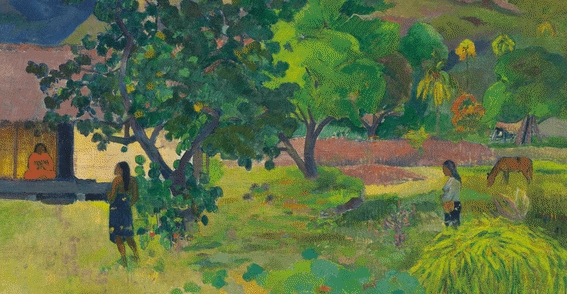

# Style Transfer AI

## Requirement

### Install

```sh
torch==1.4.0
torchvision==0.5.0
torchsummary
Pillow
```

### Dataset

```sh
wget http://images.cocodataset.org/zips/val2017.zip
```

- Download the COCO dataset
- Make `coco` directory and put it in

## Train

```py
python train.py
```

Check the setting in the `train_config.py` file before training.

- `style_image_location` : Set the path to the image of the style you want
- `checkpoint_dir` : Directory where checkpoints are saved
- `transfer_learning`, `ckpt_model_path` : If you have any checkpoint, you can use the transfer learning.

## Test

Check the setting in the `test_config.py` file before testing.

- `checkpoint_dir`, `checckpoint_file` : Set a trained style checkpoint

### Test Image

```py
python test_image.py
```

- `test_image` : Image path to inference
- `output_image` : Inferenced image path

### Test Video

```py
python test_video.py
```

- `source_file` : Video path to inference
- `output_file` : Inferenced video path
- `debug_dir` : Path to save the inferenced result for each frame

---

## Result Video

[](https://youtu.be/8BvFx-VpFQU)

---

## Image Style

| Artist | Title | Style | Result |
|--------|-------|-------|--------|
|   Claude Monet     |  Charing Cross Bridge     |       |        |
|   Claude Monet     |   San Giorgio Maggiore at Dusk    |       |        |
| Vincent van Gogh       |  Bedroom in Arles      |       |        |
| Vincent van Gogh       | Starry Night      |        |         |
| Vincent van Gogh       | Starry Night Over the Rhone      |       |        |
|   Pablo Picasso     |  Studio with Plaster Head     |        |         |
| Edgar Degas       | The Dance Foyer at the Opera on the rue Le Peletier      |       |           |
|  Henri de Toulouse      |   In bed    |        |         |
|  Paul Gauguin      |  Te Fare (La maison)     |        |        |

## Examples

### Claude Monet

#### Charing Cross Bridge

| Style  | Result |
|--------|--------|
|        |        |

#### San Giorgio Maggiore at Dusk

| Style | Result |
|-------|--------|
|       |        |

### Vincent van Gogh

#### Bedroom in Arles

| Style | Result |
|-------|--------|
|       |        |

#### Starry Night

| Style | Result |
|-------|--------|
|       |        |

#### Starry Night Over the Rhone

| Style | Result |
|-------|--------|
|       |        |

### Pablo Picasso

#### Studio with Plaster Head

| Style | Result |
|-------|--------|
|       |        |

### Edgar Degas

#### The Dance Foyer at the Opera on the rue Le Peletier

| Style | Result |
|-------|--------|
|       |        |

### Henri de Toulouse

#### In bed

| Style | Result |
|-------|--------|
|       |        |

### Paul Gauguin

#### Te Fare (La maison)

| Style | Result |
|-------|--------|
|       |        |

## Reference

- [Image Style Transfer Using Convolutional Neural Networks (2016, ECCV)](https://arxiv.org/pdf/1603.08155.pdf)
- [fast_neural_style](https://github.com/pytorch/examples/tree/master/fast_neural_style)
